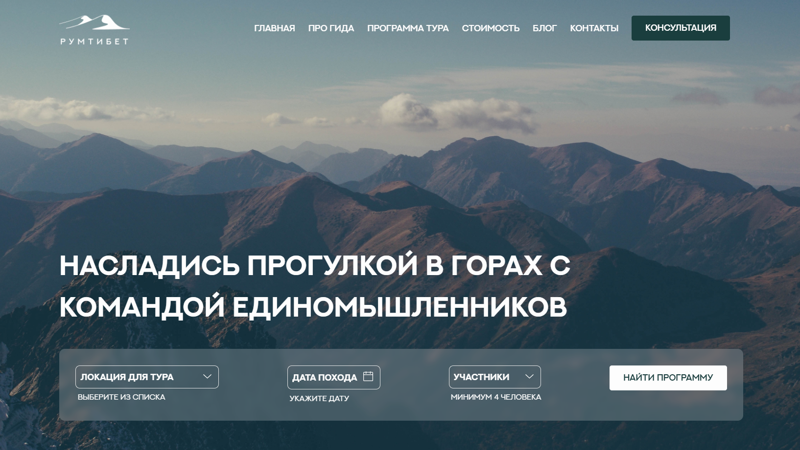
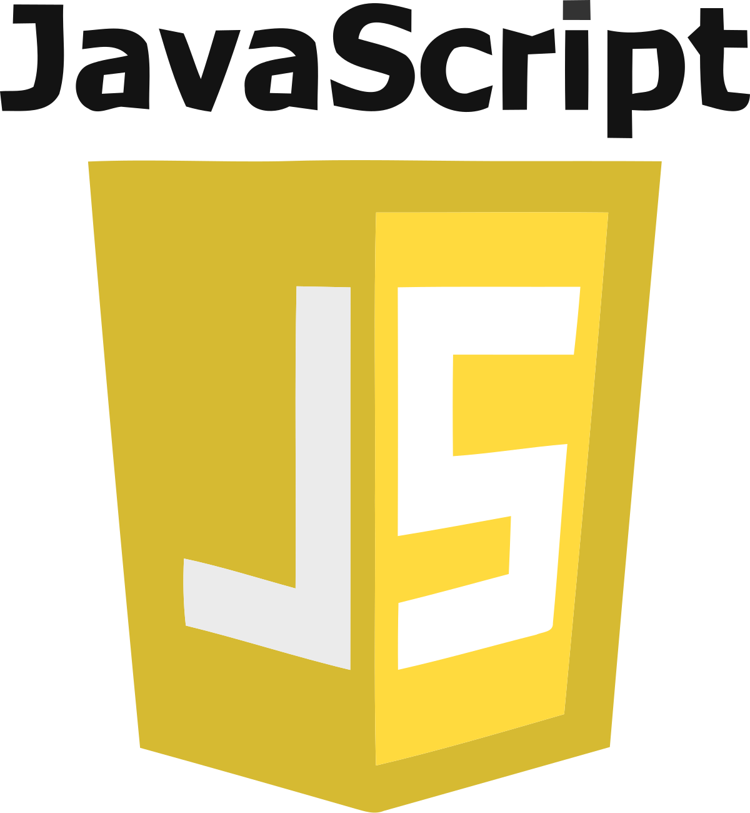
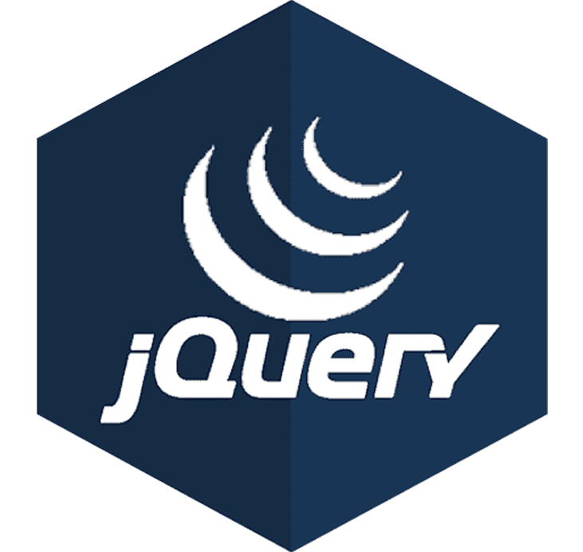

# RUMTIBET

This project is a landing page implementation for a travel agency, based on an open-source design layout.

## 🗻 Tech Stack

-  HTML5
-  CSS3
-  JavaScript
-  jQuery

👉 [View live demo](https://gapeeve.github.io/rumTibet/)

## 🌅 Key Features

- Fully responsive layout
- Interactive elements powered by jQuery
- Semantic HTML markup
- CSS animations and visual effects
- Animated sliders and modal windows
- BEM methodology implementation

## 🌄 Design Source

The project follows the original design layout:

- Figma: [RUMTIBET](https://www.figma.com/design/NrPZZU8u1sLytOicIHcIAx/РумТибет?node-id=0-1&p=f&t=oseTYI7yfUk4Oyp6-0)
- Designer: [Yuri Avanesov](https://avanesov.pro/portfolio/rumtibet/)

## License

Created for educational purposes.  
All design rights belong to the layout author.  
Source code is available under the MIT license.